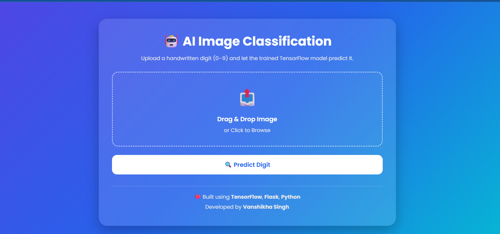
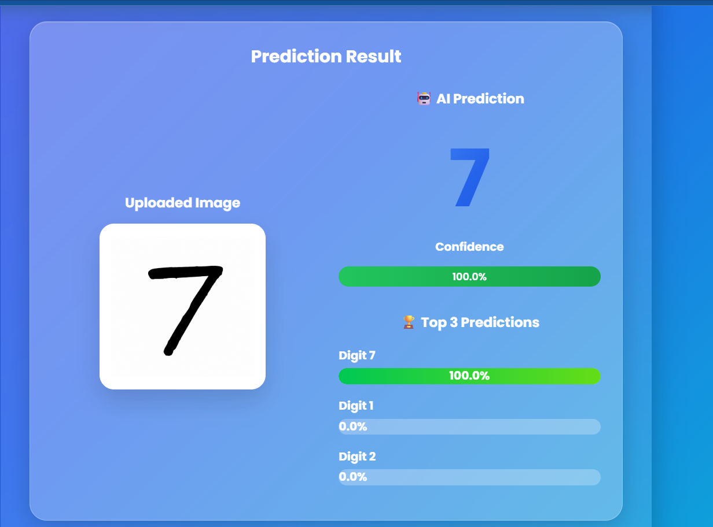

# 🤖 AI Handwritten Digit Recognition using CNN

A modern web application that recognizes handwritten digits (0–9) using a **Convolutional Neural Network (CNN)** trained on the **MNIST dataset**. The project features a beautiful **Glassmorphism UI**, automatic image preprocessing with **OpenCV**, and real-time predictions using **Flask**.

---

## 📌 Features

- 🔢 Handwritten Digit Recognition (0–9)
- 🧠 CNN Model built using TensorFlow/Keras
- 🎯 Achieved **99.59% Test Accuracy**
- 📤 Drag & Drop Image Upload
- 🖼️ Image Preview Before Prediction
- ⚡ Real-Time Prediction
- 📊 Confidence Score Visualization
- 🏆 Top-3 Predicted Digits
- 🎨 Modern Glassmorphism User Interface
- 📱 Responsive Design
- ⚠️ Error Handling for Invalid Files
- 🚀 Fast Flask Backend

---

## 🛠️ Tech Stack

| Technology | Purpose |
|------------|---------|
| Python | Programming Language |
| TensorFlow | Deep Learning Framework |
| Keras | CNN Model |
| OpenCV | Image Preprocessing |
| NumPy | Numerical Computation |
| Flask | Backend Framework |
| HTML5 | Frontend |
| CSS3 | Styling |
| JavaScript | Client-side Interactivity |

---

## 📂 Project Structure

```text
Image-Classification-Project/
│
├── app.py
├── predict.py
├── train.py
├── requirements.txt
├── README.md
│
├── model/
│   └── mnist_model.keras
│
├── static/
│   ├── style.css
│   ├── uploads/
│   └── processed/
│
├── templates/
│   └── index.html
│
└── screenshots/
    ├── home.png
    ├── prediction.png
    └── top3.png
```

---

## 🧠 Model Architecture

The model is a **Convolutional Neural Network (CNN)** trained on the MNIST handwritten digit dataset.

### Architecture

- Conv2D (32 Filters)
- MaxPooling2D
- Conv2D (64 Filters)
- MaxPooling2D
- Flatten Layer
- Dense (128 Neurons)
- Dropout Layer
- Dense (10 Output Classes using Softmax)

---

## 🖼️ Image Preprocessing

Before prediction, every uploaded image undergoes automatic preprocessing:

- Convert image to grayscale
- Background detection
- Automatic color inversion (if required)
- Thresholding
- Digit extraction using contours
- Center alignment
- Resize to **28 × 28**
- Pixel normalization
- Prediction using CNN model

This preprocessing allows the application to work with different handwritten image styles.

---

## 🚀 Installation

### 1. Clone the Repository

```bash
git clone https://github.com/YOUR_USERNAME/Image-Classification-Project.git
```

### 2. Navigate to Project Directory

```bash
cd Image-Classification-Project
```

### 3. Create Virtual Environment

```bash
python -m venv venv
```

### 4. Activate Virtual Environment

Windows

```bash
venv\Scripts\activate
```

Linux / Mac

```bash
source venv/bin/activate
```

### 5. Install Dependencies

```bash
pip install -r requirements.txt
```

### 6. Run the Flask Application

```bash
python app.py
```

Open your browser and visit:

```
http://127.0.0.1:5000
```

---

## 📷 Screenshots

### Home Page



### Prediction Result



---

## 📈 Model Performance

| Metric | Value |
|--------|-------|
| Dataset | MNIST |
| Model | CNN |
| Test Accuracy | **99.59%** |
| Classes | 10 |
| Image Size | 28 × 28 |

---

## 🌟 Future Improvements

- ✏️ Draw Digit on Canvas
- 📱 Better Mobile Support
- 🌙 Dark Mode
- 📂 Batch Image Prediction
- 📈 Prediction History
- 🌐 REST API
- ☁️ Cloud Deployment
- 📦 TensorFlow Lite Version

---

## 👩‍💻 Author

**Vanshikha **

B.Tech Computer Science Engineering

Artificial Intelligence & Machine Learning Enthusiast

GitHub: https://github.com/Vanshikha2024

LinkedIn: www.linkedin.com/in/vanshikha-b2037b2b7

---

## 📜 License

This project is developed for learning and as part of internship project.


---

